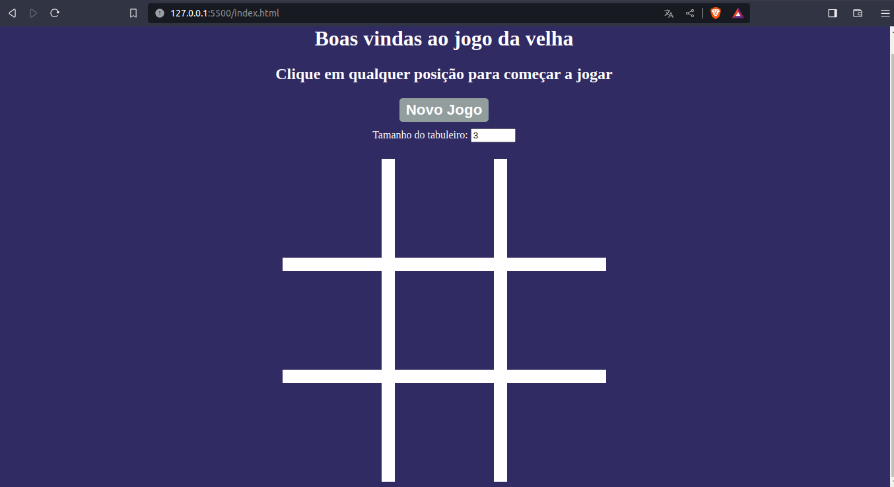
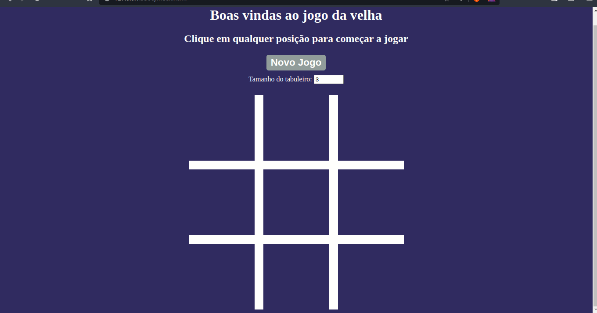

# Jogo da Velha

</img>
</img>

## Projeto Jogo da Velha

O Projeto Jogo da Velha faz parte do **Curso formação Dev na trilha Fundamentos**.

Neste projeto, foi criado uma aplicação de jogo da velha utilizando HTML, CSS, Javascript. A lógica do jogo utilizando orientação a objetos em Javascript para criar classes que representem os elementos do jogo e a lógica entre suas interações, praticando não só de conceitos de programação JavaScript, mas também os paradigma de programação orientada a objetos. 

Toda a mecânica do jogo é independente da interface, e a lógica será integrada a uma interface gráfica que foi desenvolvida utilizando HTML e CSS para criar um jogo completamente funcional.

## 🕹️ Como usar este projeto
Uma vez que a aplicação esteja rodando, basta clicar em novo jogo e escolhe o tamanho do tabuleiro. 

Para dar início basta clicar um campo vazio do tabuleiro e começar com "X", em seguida o outro jogador faz sua jogada com o "0". 

O jogo termina com alguém fazendo uma sequência em linha(horizontal, vertical ou em diagonal) de "x" ou "0" igual ao tamanho do tabuleiro, ou jogo termina empatado.

## ⚙️ Tecnologias usadas no projeto
- 
- 
- 

## 🗂️ Como este projeto está organizado

* **Arquivo estilo.css** - Onde foi inplementado os estilos em CSS puro.
* **Arquivo index.html** - O html integrou tanto o arquivo _estilo.css_ quando o arquivo _script.js_ para o jogo roda em um browser.
* **Arquivo script.js** - Onde foi colocado toda lógica do jogo desenvolvida em POO.

## 🖥️ Como rodar este projeto
Para rodar o projeto basta dar dois cliques no arquivo *index.html* uma vez que a pasta do projeto esteja aberta no sistema de arquivos do seu sistema operacional.

Alternativamente você também pode utilizar a extensão [Live Server](https://marketplace.visualstudio.com/items?itemName=ritwickdey.LiveServer) da IDE Visual Studio Code para rodar o projeto.

## ⭐ Dependências principais
<!-- API's importantes-->
Não existe dependências no projeto.

## 🆘 Precisa de ajuda?
Você pode me contatar através desses contatos:

Feito com 🧑‍💻 por Marcelo
